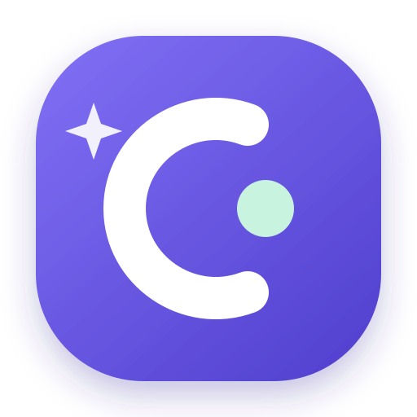
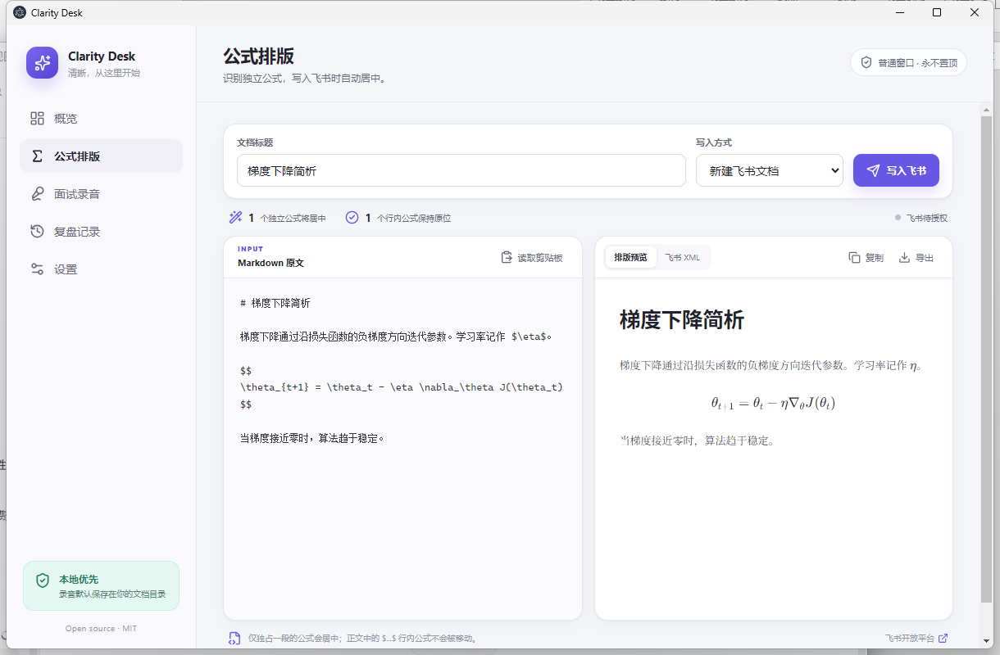
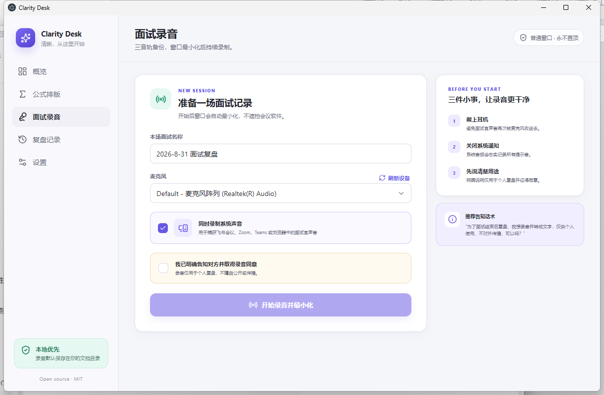
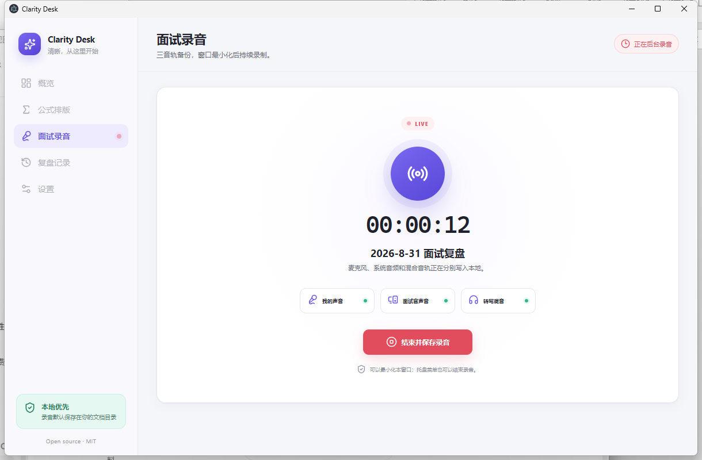
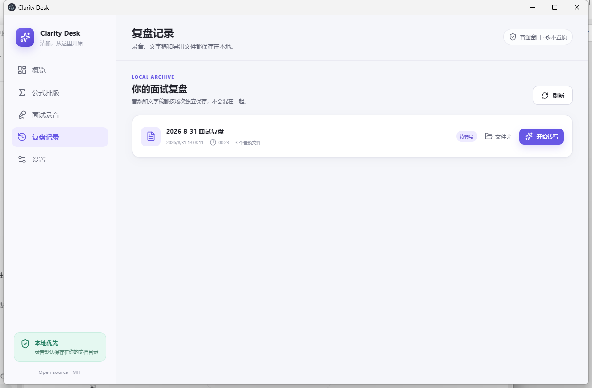

<div align="center">
  
  <h1>Clarity Desk</h1>
  <p>飞书公式排版与在线面试复盘，一套安静、隐私友好的 Windows 桌面工具。</p>
  <p>
    
    
    
    
  </p>
</div>

Clarity Desk 解决两个具体问题：

1. 把大模型生成的 Markdown 写进飞书时，自动识别独立公式并居中，同时保留行内公式的位置。
2. 在线面试时分别录制麦克风、系统声音和混合音轨，结束后生成带说话人时间轴的文字稿。

它是普通桌面窗口，**不会置顶，也没有遮挡会议界面的悬浮层**。开始录音后窗口自动最小化，托盘菜单仍可安全停止录音。


## 功能

### 飞书公式排版

- 支持 `$...$` 行内公式、`$$...$$` 和 `\[...\]` 独立公式。
- 只有独占一段的公式会居中，正文中的公式不会被移动。
- 保留标题、粗体、斜体、列表、引用、代码块、链接、图片和 GFM 表格。
- 实时 KaTeX 预览，可复制或导出飞书 XML。
- 检测到 `lark-cli` 后，可新建、追加或覆盖飞书文档。
- 原始 HTML 按文本转义，避免把不可信内容注入 XML。



### 面试录音与转写

- 麦克风、系统声音、混合音轨三路独立保存。
- 数据按秒追加到磁盘，每 10 分钟生成一个可管理的切片。
- 异常退出后，下次启动会恢复已经落盘的 `.partial` 片段。
- 录音期间关闭主窗口会隐藏到托盘，不会误结束录音。
- 混合音轨可使用 OpenAI `gpt-4o-transcribe-diarize` 生成说话人时间轴。
- OpenAI API Key 通过 Electron `safeStorage` 调用 Windows DPAPI 加密保存。
- 没有遥测、自动上传或后台分析；只有主动点击“开始转写”才会上传混合音轨。



<details>
  <summary>查看录音中与会话归档界面</summary>

  

  
</details>

## 安装

### 下载发行版

在 GitHub Releases 下载：

- `Clarity-Desk-Setup-*-x64.exe`：安装版。
- `Clarity-Desk-Portable-*-x64.exe`：免安装版。

首个开源版本暂未购买 Windows 代码签名证书，SmartScreen 可能显示“未知发布者”。请只从项目的 GitHub Releases 下载，并在运行前核对 Release 中公布的 SHA-256。

首次录音时，Windows 会请求麦克风权限。系统音频回环目前以 Windows 10/11 为主要支持平台。

### 从源码运行

要求：

- Node.js 22.12+；CI 与发布使用 Node.js 22 LTS。
- Windows 10/11。
- npm 10+。

```bash
git clone <your-repository-url>
cd clarity-desk
npm ci
npm run dev
```

质量检查：

```bash
npm test
npm run typecheck
npm run build
```

生成 Windows 安装包和便携版：

```bash
npm run dist:win
```

产物位于 `release/`。

## 飞书连接

公式预览、复制和 XML 导出不需要任何账号。直接写入飞书是可选能力，需要安装官方命令行工具：

```bash
npm install -g @larksuite/cli
lark-cli auth login --domain docs
```

随后在 Clarity Desk 的“设置 → 飞书文档”中重新检测。授权由飞书页面完成，应用不会保存飞书密码。

> 飞书接口与 `lark-cli` 会持续更新。遇到兼容问题时，请在 Issue 中附上 Clarity Desk、`lark-cli --version` 和飞书客户端版本，但不要粘贴访问令牌。

## 转写设置

在“设置 → 语音转写”中填写 OpenAI API Key。密钥只以系统加密后的形式存放在 Electron 用户数据目录。

录音文件默认位于：

```text
文档/Clarity Desk/Sessions/<session-id>/
├── metadata.json
├── microphone-0000.webm
├── system-0000.webm
├── mixed-0000.webm
├── transcript.json      # 转写后生成
└── transcript.md        # 转写后生成
```

OpenAI 文件转写单文件上限为 25 MB；10 分钟 Opus 切片通常明显小于这一上限。音频上传会产生 API 费用，具体以你的 OpenAI 账户为准。

## 录音合规

请在录音前明确告知对方录音目的、使用范围和保存方式，并取得同意。推荐话术：

> 为了面试结束后复盘，我想录音并转成文字，仅供个人使用、不对外传播，可以吗？

如果对方不同意，请不要录音。Clarity Desk 的同意勾选是操作提醒，不替代你所在地的法律义务。详见 [PRIVACY.md](PRIVACY.md)。

## 架构

```text
Renderer (React)
  ├─ Markdown AST → 飞书 XML / KaTeX 预览
  └─ MediaRecorder → 麦克风 / 系统 / 混合音频
                │
        typed, isolated IPC
                │
Electron Main Process
  ├─ 会话文件、异常恢复、系统托盘
  ├─ safeStorage 密钥加密
  ├─ OpenAI 文件转写
  └─ lark-cli 飞书写入
```

详细设计见 [docs/ARCHITECTURE.md](docs/ARCHITECTURE.md)。

## 路线图

- [ ] 本地 `faster-whisper` 离线转写后端。
- [ ] 录制个人 2–10 秒参考音频，自动把说话人标记为“我”。
- [ ] 会话内重命名说话人与再次导出。
- [ ] 针对会议应用的单进程系统音频捕获。
- [ ] macOS 系统音频支持。
- [ ] 国际化与英文界面。

## 贡献

欢迎 Issue 和 Pull Request。开始前请阅读 [CONTRIBUTING.md](CONTRIBUTING.md)、[SECURITY.md](SECURITY.md) 与 [CODE_OF_CONDUCT.md](CODE_OF_CONDUCT.md)。

## License

[MIT](LICENSE) © 2026 Clarity Desk contributors.
