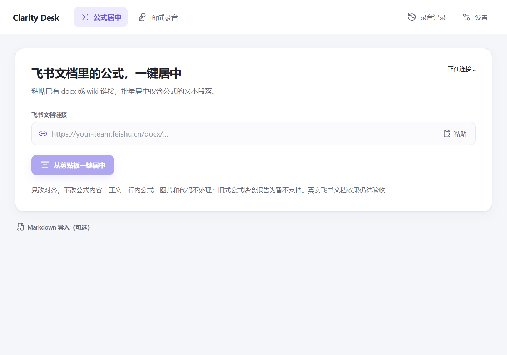
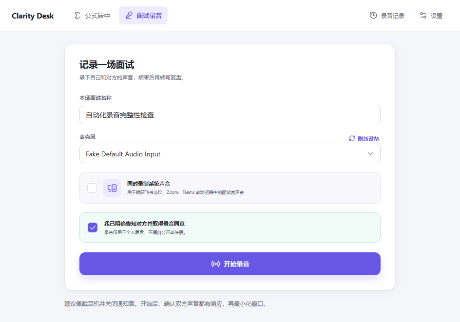
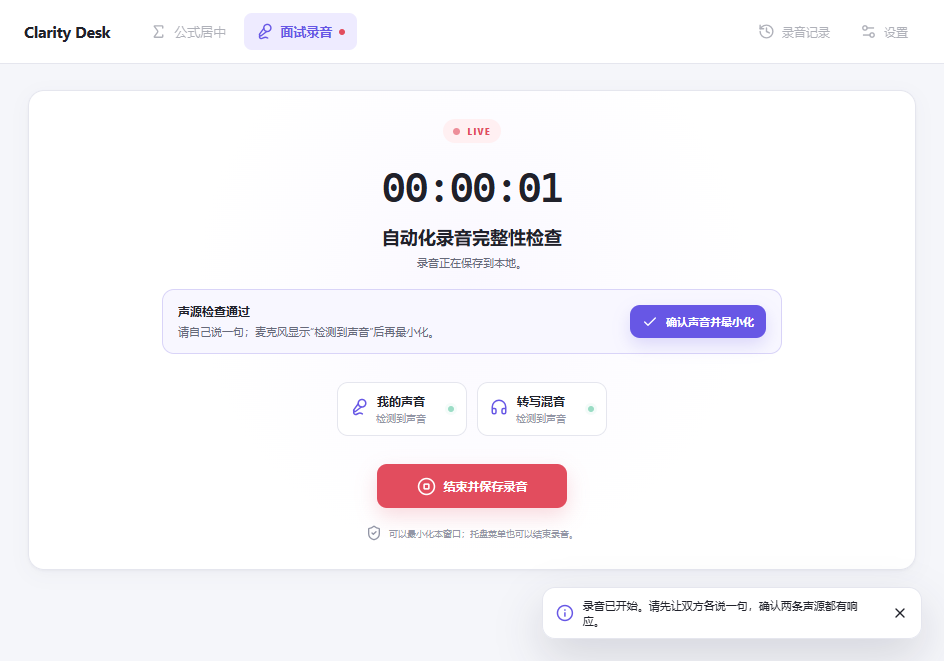

<p align="center">
  
</p>

<h1 align="center">Clarity Desk</h1>

<p align="center"><strong>飞书公式一键居中，面试录音随手复盘。</strong></p>

<p align="center">
  <a href="https://github.com/LOGO127/clarity-desk/releases/latest"></a>
  
  <a href="https://github.com/LOGO127/clarity-desk/actions/workflows/ci.yml"></a>
  <a href="LICENSE"></a>
</p>

<p align="center">
  <a href="#下载">下载</a> · <a href="#飞书公式一键居中">公式居中</a> ·
  <a href="#面试录音与转写">录音复盘</a> · <a href="#轻量化">轻量化</a> ·
  <a href="#验证与限制">验证与限制</a>
</p>

<p align="center">
  
</p>

打开应用就能处理文档。公式工具只需要一个链接；面试录音放在旁边，记录和设置随用随开。录音默认留在本地，由你决定何时转写。

## 下载

当前已发布版本为 [v0.2.0](https://github.com/LOGO127/clarity-desk/releases/tag/v0.2.0)，面向 Windows 10/11 x64。**本文展示的轻量界面与安全修正属于待验收的 v0.3.0 开发版本，尚未发布。v0.2.0 的公式兼容性问题见下文，不应当作“所有公式均可居中”的已验收版本。**

| 文件 | 使用方式 |
| --- | --- |
| `Clarity-Desk-Portable-0.2.0-x64.exe` | 双击运行，无需安装 |
| `Clarity-Desk-Setup-0.2.0-x64.exe` | 选择目录安装，创建桌面快捷方式 |
| `SHA256SUMS.txt` | 核对同一 Release 中下载文件的 SHA-256 |

当前为公开测试版，尚未代码签名，SmartScreen 可能提示未知发布者。请从本仓库 Releases 下载。便携版首次启动会释放运行库，需要等待数秒。

## 飞书公式一键居中

1. 复制你正在编辑的飞书 **docx 或 wiki 文档链接**。
2. 打开 Clarity Desk，点击 **从剪贴板一键居中**；也可以先粘贴链接。
3. 等待结果，核对已提交更新与回读确认的数量。

程序读取文档块，筛选**只包含飞书公式元素的文本段落**，然后批量修改对齐样式，不重写公式内容。正文和含普通文字的行内公式段落保持原样。这个按钮位于 Clarity Desk 中，不会添加到飞书客户端工具栏。

**目前不能承诺所有公式都能居中。** 旧式独立公式块（`block_type: 16`）的样式更新尚未确认支持，会跳过并报告未处理数量；图片、代码块和未转换成飞书公式的 LaTeX 文字也不处理。本轮发现 v0.2.0 对旧式公式块使用了缺少必填字段的请求，已停止使用该请求。2026-09-05 已在合成飞书文档上完成真实按钮测试：3 个待处理公式成功居中，1 个已居中公式保持不变，重复点击不再提交更新，其他内容未变；飞书导出 PDF 也确认居中。**网页刷新视觉检查及用户实际粘贴样例仍待验收。** 详见 [真实验收记录](docs/FEISHU-ACCEPTANCE-20260905.md) 和 [兼容性范围](docs/FEISHU-COMPATIBILITY.md)。

长文档中途失败时会显示“部分完成”及已提交、已确认数量。重新点击会跳过已经居中的公式。若网络中断导致回读失败，已提交数量不代表已经确认生效。

### 首次连接飞书

需要安装 `lark-cli`，完成本人授权，并拥有目标文档的编辑权限：

```powershell
npm install -g @larksuite/cli
lark-cli auth login --domain docs
```

随后在应用“设置 → 飞书文档”中重新检测。首次使用建议先在测试文档中验收。

### 可选 Markdown 导入

点击主面板下方 **Markdown 导入（可选）**，再加载编辑器与公式预览。支持行内 `$...$`、`\(...\)` 及独立 `$$...$$`、`\[...\]` 公式，可复制/导出 XML，或新建、追加、覆盖飞书文档。

直接居中现有文档不需要复制正文，也不需要打开这个导入工具。

## 面试录音与转写

1. 打开 **面试录音**，选择麦克风，保持“同时录制系统声音”开启。
2. 告知对方并取得录音同意后，点击 **开始录音**。
3. 自己说一句，并让对方或会议的扬声器测试发出声音。检查麦克风、系统声和混音的响应，点击 **确认声音并最小化**。
4. 面试结束后，从任务栏或托盘停止录音；在 **录音记录** 中打开文件夹或开始转写。

<p align="center">
  
  
</p>

建议佩戴耳机并关闭通知音。系统声捕获的是默认输出设备的整路声音，并非仅面试软件。信号指示表示检测到声音，不保证识别到了指定说话人。

### 录音保存

启用系统声音时，分别保存麦克风、系统声、混合音轨；关闭系统声音时保存麦克风与混音。每秒写入磁盘，每十分钟生成一个分段。逐段检查必需音轨，设备断开或写盘失败会报告故障并停止，已有数据保留供检查。

```text
文档/Clarity Desk/Sessions/<session-id>/
├── metadata.json
├── microphone-0000.webm
├── system-0000.webm
├── mixed-0000.webm
├── transcript.partial.json  # 转写断点，成功完成后清理
├── transcript.json
└── transcript.md
```

异常退出后会尝试恢复落盘文件；已标为失败的会话不会因为恢复出部分文件就变成成功。恢复记录可能不完整，请先试听。

等待录音授权和录音期间会锁定页面切换；取消授权后可以重试。重复启动同一配置的新版应用只会唤回原窗口，不会重复执行录音恢复。

### 转成文字

在“设置 → 语音转写”中保存 OpenAI API Key，然后主动点击 **开始转写**。当前使用 `gpt-4o-transcribe-diarize`，会上传混合音轨并可能产生 API 费用。

每个切片完成后保存断点；中途失败再试，会复用有效的已完成切片。多切片的说话人标签带有“片段 01 / 02”前缀，因为不同切片中的同名标签不保证是同一人。当前不自动命名为“我 / 面试官”。

## 轻量化

正在开发的 `v0.3.0` 聚焦日常使用的负担：

- 默认直接打开公式居中；紧凑导航，默认窗口从 1220 × 800 调整为 960 × 700。
- Markdown 编辑器、KaTeX、录音、记录与设置按需加载；初始 JavaScript 约 **211 KB**，此前约 **1.56 MB**。
- 移除已经编译进界面的重复运行依赖，仅保留主进程需要的库。
- Chromium 语言资源仅保留中文和英文。

这仍是一款 Electron 应用。首屏代码大小并不等于内存占用；安装包、解压体积和测量方式见 [轻量化记录](docs/LIGHTWEIGHT.md)。后续优先小步改进操作和占用，不自动下载本地大模型。

## 隐私

录音与文字稿默认留在本地；没有遥测或自动上传。只有主动转写、飞书授权和文档操作使用相应服务。飞书连接检测也可能由 CLI 发起认证状态检查。

API Key 使用系统安全存储加密，应用不会以明文保存；飞书凭据由 `lark-cli` 管理。卸载不会静默删除录音。详见 [PRIVACY.md](PRIVACY.md) 和 [SECURITY.md](SECURITY.md)。

## 验证与限制

发布检查包含单元测试、TypeScript、生产构建、Electron 桌面回归和最终打包程序启动。桌面回归使用合成麦克风、隔离录音目录，验证首屏按需加载、公式预览、声源确认、最小化、录音落盘与外链隔离。

| 边界 | 当前情况 |
| --- | --- |
| 飞书真实修改 | 合成 docx 样例的按钮更新、回读、内容保护和重复点击已通过；PDF 排版通过，网页视觉待登录，旧式公式块不承诺支持 |
| 系统回环音频 | v0.2 实机验证过；本轮自动回归使用合成麦克风，不代表所有设备组合 |
| OpenAI 转写 | 断点与响应校验有测试，本轮未调用付费 API |
| 录音硬件 | 正式面试前应做短录音并试听；蓝牙、声卡、会议软件会影响捕获 |
| 离线转写、macOS 系统音频 | 尚未支持 |

这些检查不代表没有 bug。具体测试结果及版本变化见 [CHANGELOG.md](CHANGELOG.md)。

## 开发

需要 Node.js 22.12+；本轮本地验证使用 Node.js 24。

```powershell
git clone https://github.com/LOGO127/clarity-desk.git
cd clarity-desk
npm ci
npm run dev
```

```powershell
npm test
npm run typecheck
npm run test:desktop
npm run dist:win
node scripts/electron-smoke.cjs --packaged
```

`test:desktop` 只在 Windows 上运行，截图和合成录音位于忽略提交的 `output/playwright/`。两种回归都使用隔离配置和显式测试开关，不扫描真实录音目录；打包回归只检查页面和启动，不采集音频。CI 只上传三张合成界面截图，保留 7 天，不上传录音或配置目录。最终安装文件位于 `release/`。

架构见 [docs/ARCHITECTURE.md](docs/ARCHITECTURE.md)，参与开发见 [CONTRIBUTING.md](CONTRIBUTING.md)。提交 Issue 请使用非敏感数据，勿上传真实面试录音、密钥或飞书令牌。

Clarity Desk 是独立开源项目，与飞书、OpenAI 或任何会议软件官方无隶属或背书关系。

[MIT](LICENSE) © 2026 Clarity Desk contributors.
